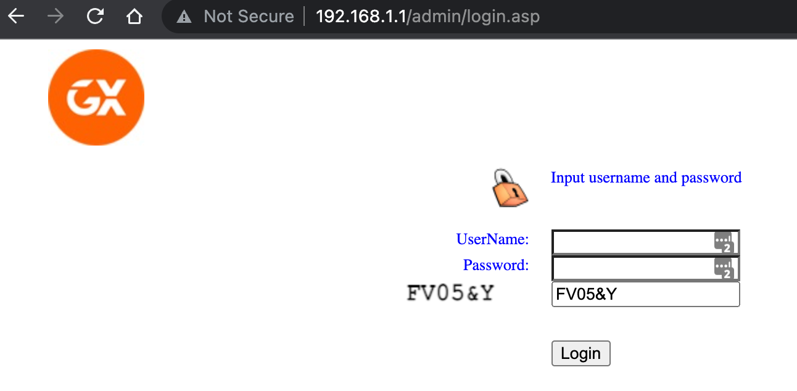

# Genexis-modem-captcha-filler

This tiny chrome extension prefills the annoying captcha on the Admin page of the modem.\
Typically addressed: http://192.168.1.1
This extension `doesn't require` the ubiquitous scary permissions like:\
` 'can read your data on all pages'`

## Installation

Load as an unpacked extension from the google chrome extensions page.

## Usage

Should be automatic.

## License
[MIT](https://choosealicense.com/licenses/mit/)